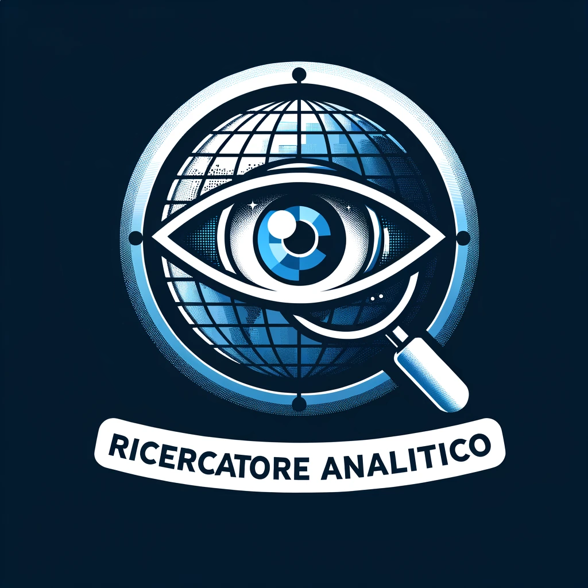
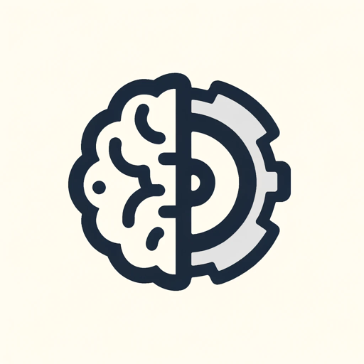
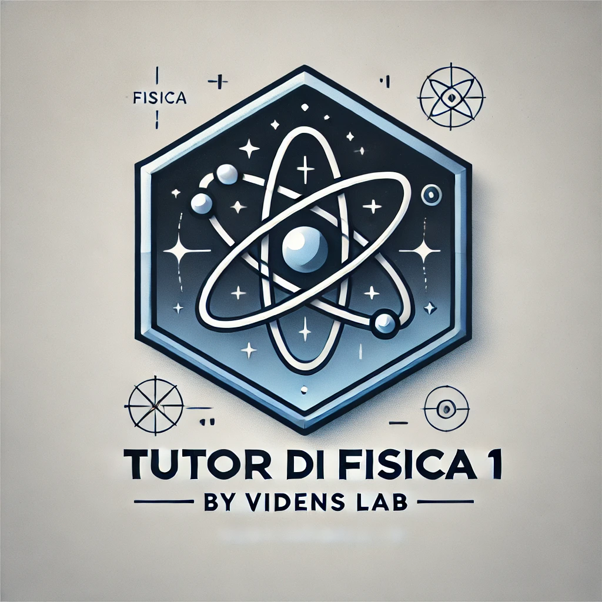

# 🤖 Edoardo Avenia's GPTs Collection

  
  
  

  
A collection of specialized AI assistants focused on education, research, and technical innovation. Each GPT is designed to solve specific challenges in learning, problem-solving, and professional development.

---

## 🌟 Featured GPTs

  <table>
    <tr>
      <td align="center" width="33.33%">
        

          
           
          <h3>🔍 Web Research Analyst</h3>
          
          
           
          
Expert in deep web analysis and research, ensuring complete understanding of complex topics.

          

            
            
          

        

      </td>
      <td align="center" width="33.33%">
        

          
           
          <h3>📐 STEM Solver</h3>
          
          
           
          
Master STEM subjects with step-by-step solutions and comprehensive explanations.

          

            
            
          

        

      </td>
      <td align="center" width="33.33%">
        

          
           
          <h3>🧠 Chain of Thought Master</h3>
          
          
           
          
Specialized in logical reasoning and critical analysis using step-by-step thinking.

          

            
            
          

        

      </td>
    </tr>
    <tr>
      <td align="center" width="33.33%">
        

          
           
          <h3>🛠️ GPT Architect for Italians</h3>
          
          
           
          
Your ally in designing custom GPTs in Italian.

          

            
            
          

        

      </td>
      <td align="center" width="33.33%">
        

          
           
          <h3>🎯 DeepSolver</h3>
          
          
           
          
Break down complex problems with methodical analysis and practical solutions.

          

            
            
          

        

      </td>
      <td align="center" width="33.33%">
        

          
           
          <h3>📚 Polytechnic QuizMaster</h3>
          
          
           
          
Interactive engineering quizzes for Polytechnic students. Integrated with PoliQuiz API.

          

            
            
          

        

      </td>
    </tr>
    <tr>
      <td align="center" width="33.33%">
        

          
           
          <h3>⚛️ Physics 1 Tutor</h3>
          
          
           
          
Specialized tutor in Physics 1 using the Feynman method and intuitive approach.

          

            
            
          

        

      </td>
      <td align="center" width="33.33%">
        

          
           
          <h3>📋 Safety Regulations Assistant</h3>
          
          
           
          
Consultant for Italian workplace safety regulations.

          

            
            
          

        

      </td>
      <td align="center" width="33.33%">
        

          
  <h3>🚌 Turin GTT Schedule Helper</h3>

 

Assistant for Turin GTT schedules with real-time API integration.

  
  

        

      </td>
    </tr>
  </table>

## 📝 About These Projects (2023-2024)

These projects, developed between late 2023 and early 2024, are initial experiments with the GPT Store to demonstrate my basic prompt engineering skills. Today, I develop more advanced solutions (LangChain, Python, direct access to LLM models) outside the GPT Store. I'm sharing them freely not only to showcase my initial AI journey but also to invite other developers to collaborate and enhance these projects, potentially recreating them outside the GPT Store with more powerful technologies.

## 👨‍💻 About the Author

  

Edoardo Avenia is a LLM Solution Architect and AI Developer specializing in creating custom AI assistants for education and professional use. With expertise in prompt engineering, API integrations, and LLM applications, he focuses on developing innovative tools that enhance learning and problem-solving capabilities.
 

  
  
  

### 📄 License

  

This project is licensed under the GNU General Public License v3.0 - see the LICENSE file for details.  